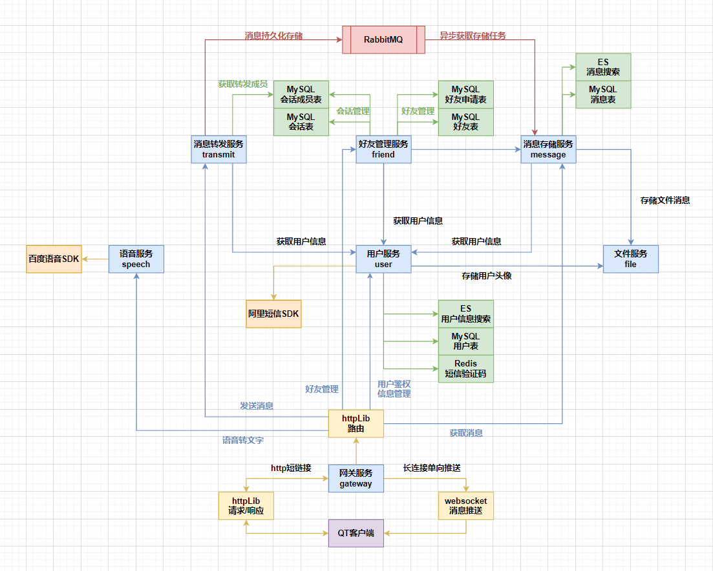

# 分布式微服务即时通信系统 Instant Messaging System

## 项目介绍

本项目是一个基于`C++`实现的分布式微服务即时通信系统，采用前后端分离架构。服务端基于微服务架构，使用`brpc` + `protobuf`作为RPC框架，采用`etcd`实现服务发现，使用`RabbitMQ`作为消息队列，实现了用户管理、消息管理、好友关系、文件传输等核心功能。客户端基于`Qt`框架开发，支持多种文本/文件/语音多种消息类型。

### 预览图


### 核心特性
- 分布式微服务架构，服务间通过RPC通信
- 支持服务注册与发现，实现服务的动态扩展
- 支持账号密码和手机号两种登录方式
- 支持单聊、群聊等多种通信方式
- 支持图片、语音等多媒体消息
- 支持离线消息、历史记录查看
- 支持实时消息推送
- 支持好友管理、会话管理
- 支持文件传输、语音转文字等功能

## 系统架构

### 服务端架构

总架构图如下：



单个子服务架构如下，以message服务为例：


### 技术栈

#### 开发环境
- 开发语言：C++17
- 构建工具：CMake (3.28.3+)
- 容器化：Docker & Docker Compose

#### 基础框架
- gflags：命令行参数解析框架
- gtest：单元测试框架
- spdlog：日志输出框架
- protobuf：数据序列化和反序列化框架
- brpc：百度开源的RPC通信框架

#### 存储系统
- MySQL：关系型数据库系统，用于业务数据的存储管理
- Redis：高性能键值存储系统，用于用户登录会话信息的存储管理
- ODB：MySQL数据操作的ORM框架
- Etcd：分布式、高可用的一致性键值存储系统，用于服务注册与发现
- Elasticsearch：用于搜索文档存储/搜索服务器，用于历史消息/用户的存储管理

#### 网络通信
- cpp-httplib：搭建HTTP服务器
- websocketpp：搭建WebSocket服务器
- RabbitMQ：搭建消息队列服务器，用于项目中持久化消息的转发消费

#### 第三方服务
- 语音云平台：采用百度语音识别技术云平台实现语音转文字功能
- 短信云平台：采用阿里云短信云平台实现手机短信验证码通知功能

### 系统架构设计

### 核心服务模块

1. 网关服务 (Gateway Server)
   - 端口：9000, 9001
   - 功能：负责客户端连接管理和消息路由
   - 依赖：etcd, redis

2. 消息服务 (Message Server)
   - 端口：9006
   - 功能：处理消息的存储、转发和管理

3. 用户服务 (User Server)
   - 端口: 9004
   - 功能：用户账号管理、认证和授权
   - 依赖：mysql, redis

1. 好友服务 (Friend Server)
   - 端口：9007
   - 功能：好友关系管理
   - 依赖：etcd, mysql, elasticsearch

2. 文件服务 (File Server)
   - 端口：9002
   - 功能：文件上传、下载和管理
   - 依赖：etcd

3. 语音服务 (Speech Server)
   - 端口：9003
   - 功能：语音消息处理
   - 依赖：etcd

4. 传输服务 (Transmit Server)
   - 端口：9005
   - 功能：负责消息传输和转发
   - 依赖：etcd, mysql, rabbitmq

### 目录结构
```
server/
├── common/     # 公共组件
├── conf/       # 配置文件
├── file/       # 文件服务
├── friend/     # 好友服务
├── gateway/    # 网关服务
├── message/    # 消息服务
├── odb/        # 对象数据库映射定义
├── proto/      # protobuf协议定义
├── speech/     # 语音服务
├── sql/        # 数据库初始化脚本
├── third/      # 第三方依赖
├── transmit/   # 消息转发服务
├── user/       # 用户服务
├── CMakeLists.txt
├── docker-compose.yml
├── depends.sh  # 依赖安装脚本
└── entrypoint.sh
```

### 编译说明

#### 环境要求
- Ubuntu 24.04 或更高版本
- CMake 3.28.3 或更高版本
- Docker & Docker Compose
- GCC/G++ 支持C++17

#### 编译步骤

1. 安装系统依赖
```bash
./depends.sh
```

2. 编译所有服务
```bash
cd server
mkdir build
cd build
cmake ..
make
```
### 部署说明

1. 配置文件
- 所有配置文件位于`conf/`目录
- 每个服务对应一个配置文件，如`file_server.conf`
- 服务端口，mysql用户等，前往配置文件修改

2. 启动服务
```bash
docker-compose up -d
```

### 数据持久化
所有服务的数据都通过Docker卷进行持久化存储：
- 日志文件：`./middle/data/logs`
- 数据文件：`./middle/data/data`
- MySQL数据：`./middle/data/mysql`
- Redis数据：`./middle/data/redis`
- Elasticsearch数据：`./middle/data/elasticsearch`
- RabbitMQ数据：`./middle/data/rabbitmq`

### 客户端架构

客户端整体架构如下：


### 技术栈
- 开发语言：C++
- UI框架：Qt
- 网络通信：
  - httpLib：HTTP请求/响应
  - websocket：实时消息推送
  - ProtoBuf：通信协议
- 构建工具：CMake

### 核心模块

#### 网络通信层
- httpLib请求/响应：处理HTTP短连接请求
- websocket消息推送：处理实时消息
- netclient网络通信：统一的网络接口封装

#### 数据管理层
- dataCenter：统一的数据管理中心
  - 用户信息管理
  - 会话管理
  - 消息管理
  - 好友关系管理

#### UI层
1. 登录模块
   - loginWidget：账号密码登录窗口
   - phoneLoginWidget：手机号登录窗口
   - verifyCodeWidget：验证码窗口

2. 主界面模块（mainWidget）
   - LeftWidget：选项列表
     - selfInfoWidget：个人信息窗口
   - MidWidget：好友/会话管理列表
     - addFriendDialog：好友搜索窗口
     - sessionFriendWidget：好友/会话列表
   - RightWidget：会话区
     - messageShowArea：消息展示区
     - messageEditArea：消息编辑区
     - sessionDetailWidget：会话详情窗口
     - userInfoWidget：用户信息窗口
     - historyMessageWidget：历史消息窗口
     - chooseFriendDialog：选择好友窗口

3. 功能组件
   - ImageViewer：图片查看器
   - soundRecorder：多媒体录音器
   - Toast：提示窗口

### 目录结构
```
client/
├── network/     # 网络通信模块
├── proto/       # 协议定义
├── model/       # 数据模型
├── resource/    # 资源文件
├── deploy/      # 部署文件
│   └── IMClient.exe    # 客户端启动程序
└── CMakeLists.txt
```

### 启动说明

1. 直接启动
```bash
cd deploy
双击运行 IMClient.exe
```

2. 开发环境编译
```bash
cd client
mkdir build
cd build
cmake ..
make
```
